# T2S Neural MPC

Official implementation for our paper: "T2S-MPC: Time-Embedded Two-Timescale Online Adaptive MPC for Time-Varying Dynamics"

## 🎥 Demo

### Tracking — Circle

<table align="center">
  <tr>
    <td align="center"></td>
    <td align="center">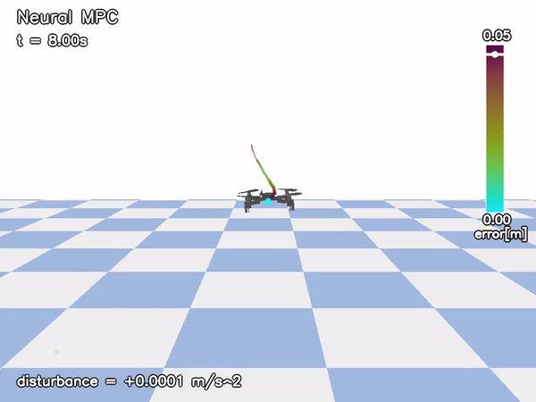</td>
    <td align="center">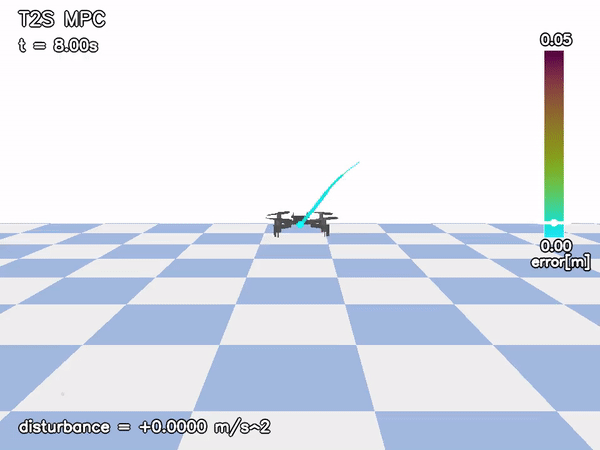</td>
  </tr>
  <tr>
    <td align="center"><b>Nominal MPC</b></td>
    <td align="center"><b>Neural MPC</b></td>
    <td align="center"><b>T2S MPC (Ours)</b></td>
  </tr>
  <tr>
    <td align="center">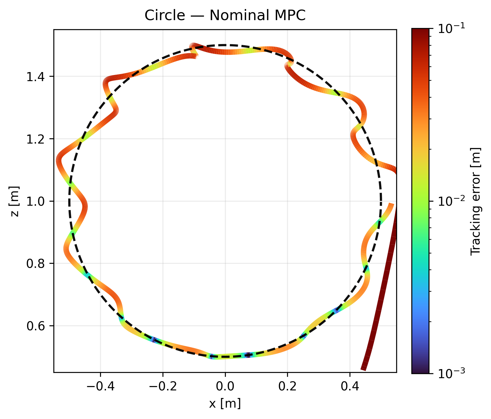</td>
    <td align="center">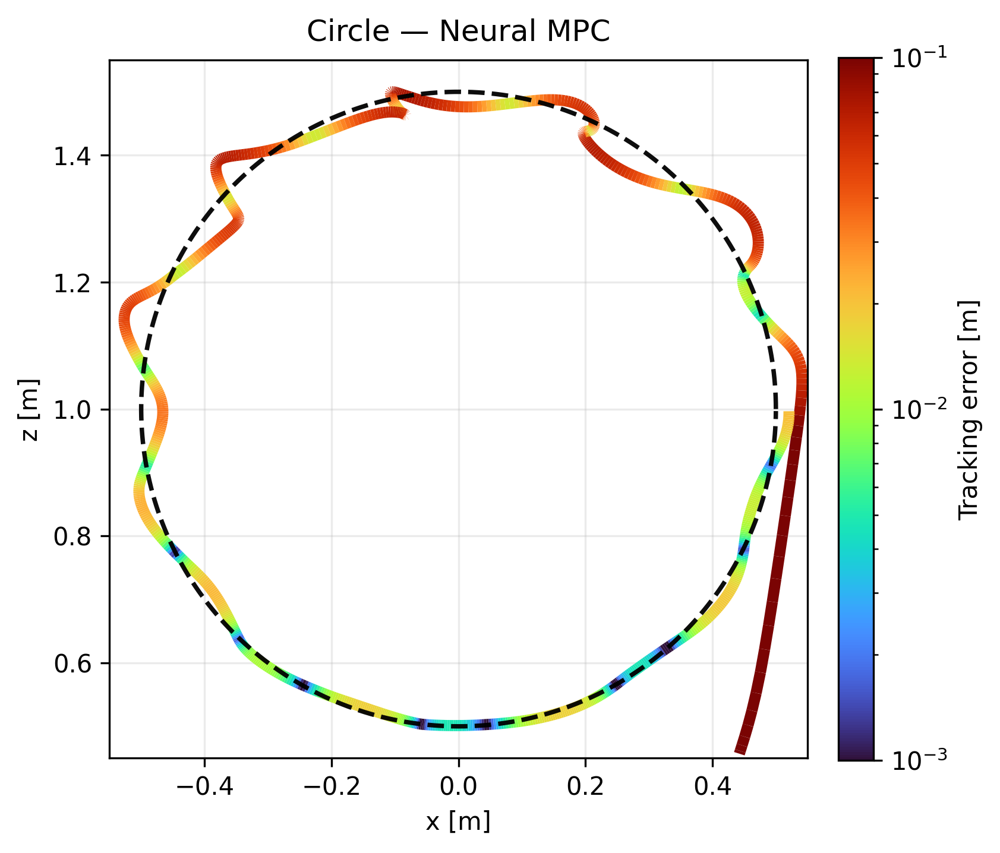</td>
    <td align="center">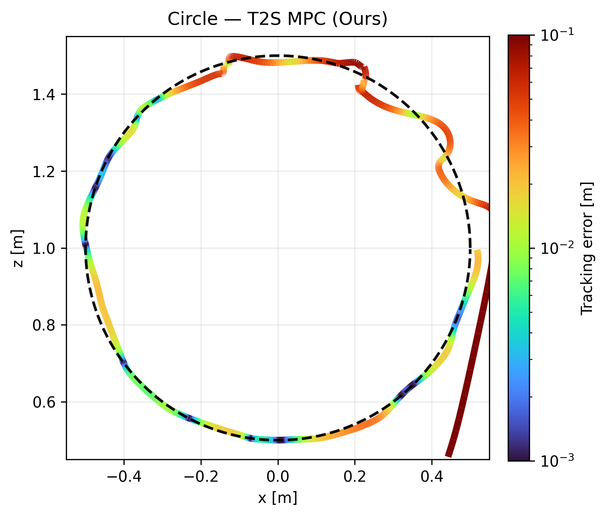</td>
  </tr>
</table>

### Tracking — Figure-8

<table align="center">
  <tr>
    <td align="center">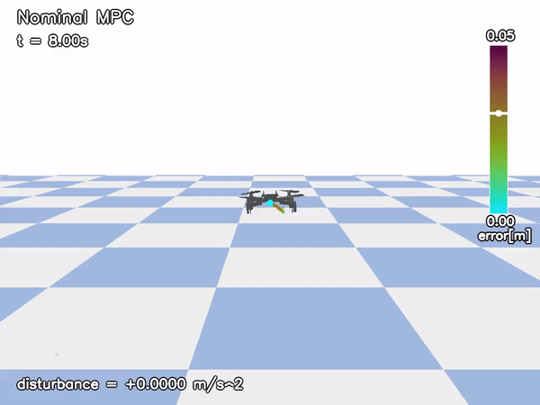</td>
    <td align="center">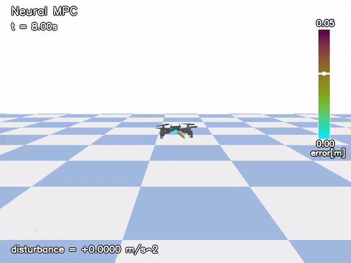</td>
    <td align="center">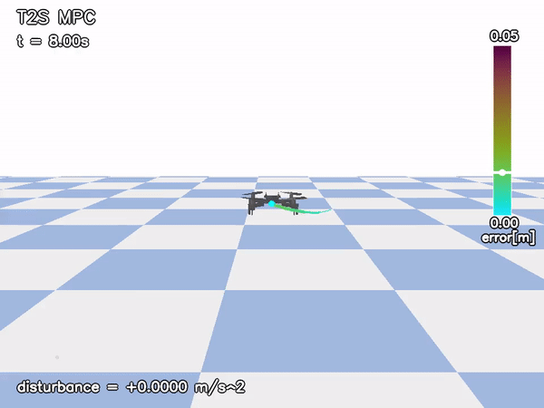</td>
  </tr>
  <tr>
    <td align="center"><b>Nominal MPC</b></td>
    <td align="center"><b>Neural MPC</b></td>
    <td align="center"><b>T2S MPC (Ours)</b></td>
  </tr>
  <tr>
    <td align="center">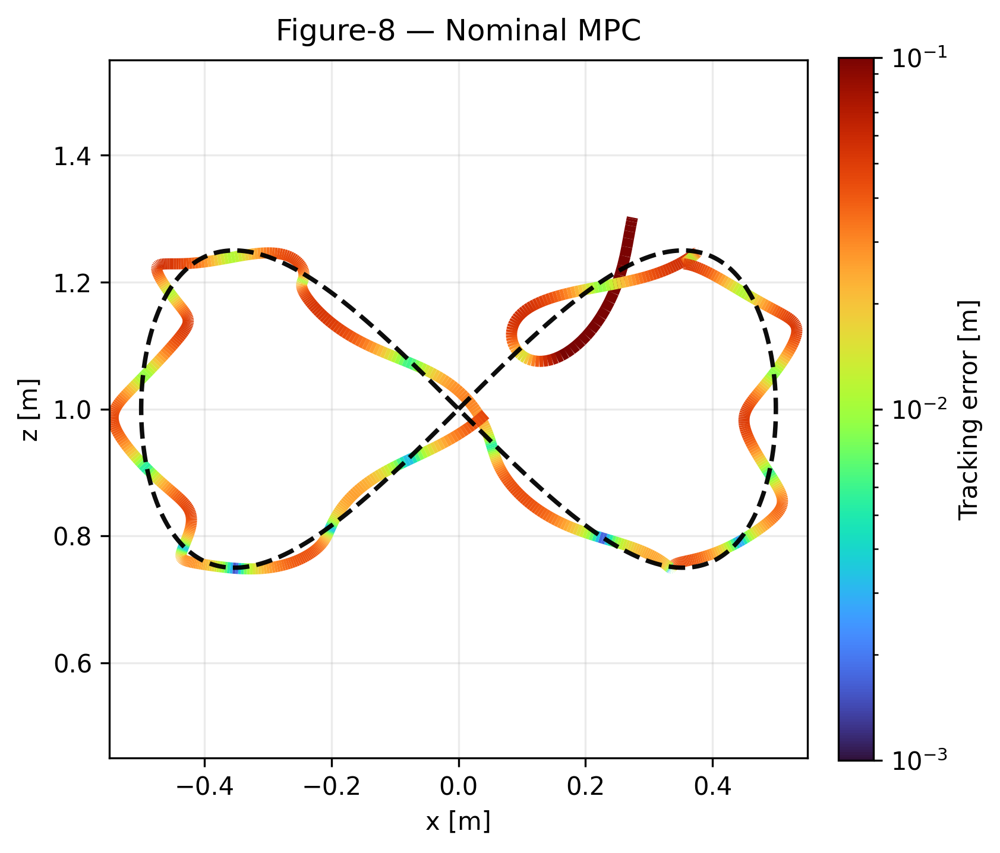</td>
    <td align="center">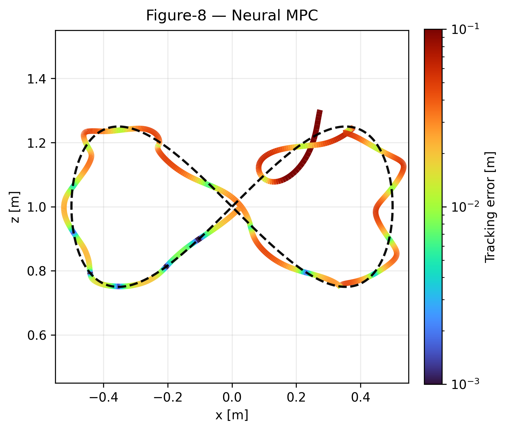</td>
    <td align="center">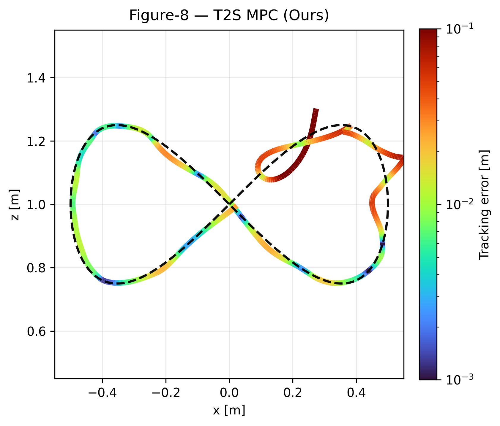</td>
  </tr>
</table>

### Stabilization

<table align="center">
  <tr>
    <td align="center">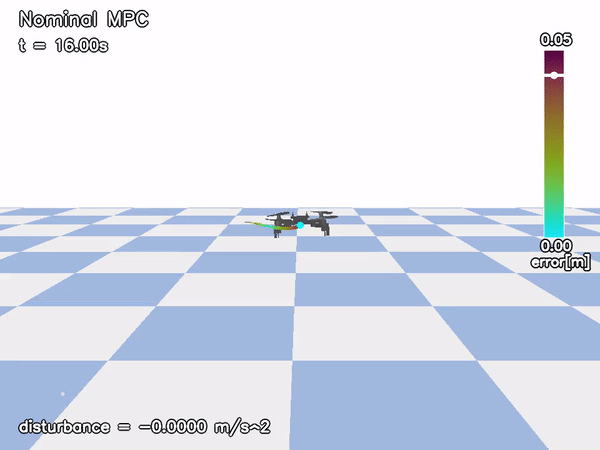</td>
    <td align="center">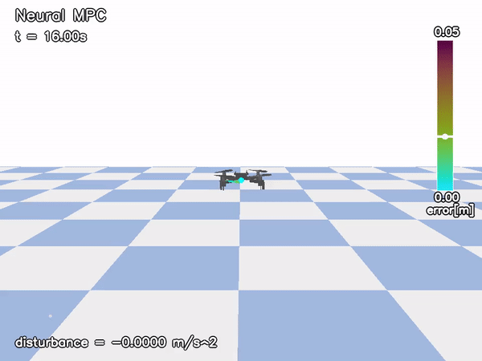</td>
    <td align="center">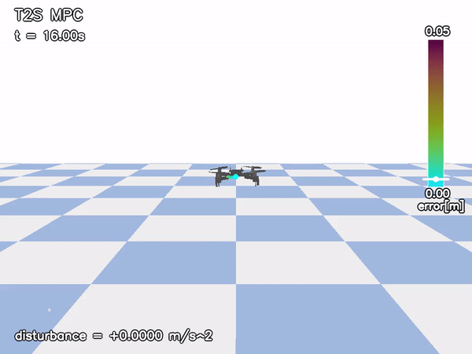</td>
  </tr>
  <tr>
    <td align="center"><b>Nominal MPC</b></td>
    <td align="center"><b>Neural MPC</b></td>
    <td align="center"><b>T2S MPC (Ours)</b></td>
  </tr>
</table>

## 🧠 Overview
<p align="center">
  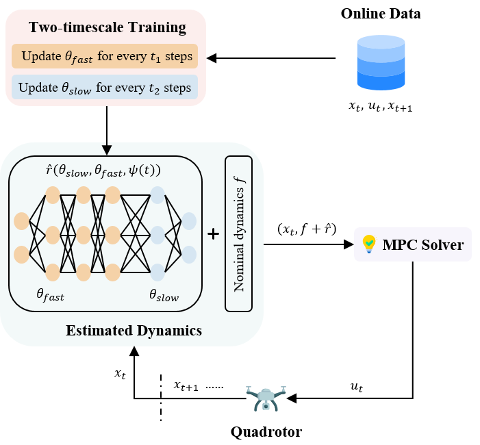
</p>
<p align="center">
  Figure 1: Method Overview.
</p>

**Key Contribution**:
-  We introduce T2S-MPC, a fully online MPC framework
that combines time-embedded neural residual modeling
with a two-timescale update scheme, enabling fast adap-
tation to time-varying dynamics while maintaining sta-
ble and robust performance across diverse disturbance
patterns within a unified model.
-  We demonstrate the effectiveness of T2S-MPC on
quadrotor stabilization and trajectory tracking tasks
under multiple time-varying disturbances. T2S-MPC
consistently achieves superior adaptation and control
performance compared to classical MPC and neural
MPC baselines.
-  We further demonstrate the robustness of T2S-MPC
through extensive ablations spanning a wide range of
disturbance magnitudes, frequencies and patterns. T2S-
MPC consistently outperforms baseline methods across
all scenarios

<p align="center">
  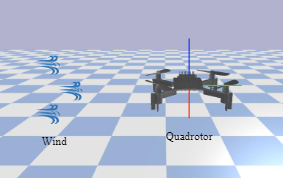
</p>
<p align="center">
  Figure 2: Simulation Instance.
</p>

## 🛠️ Installation

### Clone the repository

```git clone https://github.com/Zeyuu0920/T2S_MPC.git ```

###  Create a conda environment

```bash
conda env create -f environment.yml
conda activate l4control
```

###  Install ```l4casadi```
Install the latest version using pip with ```bash--no-build-isolation``` (GPU/CUDA supported)
```bash
pip install l4casadi --no-build-isolation
```

Source: https://github.com/Tim-Salzmann/l4casadi

###  Install acados and the acados Python interface

- Clone and build Acados
Follow the [official Acados installation guide](https://docs.acados.org/installation/index.html).

- Install the Acados Python interface

Follow the [Python interface installation guide.](https://docs.acados.org/python_interface/index.html)

###  Install safe-control-gym

Follow the [official safe-control-gym installation guide.](https://github.com/utiasDSL/safe-control-gym)

###  Override PyTorch installation
Due to version conflicts between ```bashl4casadi``` and ```bashsafe-control-gym``` , it is necessary to override PyTorch: ```bashconda install pytorch==2.5.1 torchvision==0.20.1 torchaudio==2.5.1 pytorch-cuda=12.4 -c pytorch -c nvidia```

Fix installation issues (if any)

If you encounter any remaining errors, manually install the missing or incompatible packages.
Package versions may vary depending on your system environment.

## 📌 Reproduce Main Results
We made a bash script to reproduce main results
```reproduce_main_results.sh```

Each script will make folder to store results automatically.

## 📚 Repository Structure

```bash
T2S_Neural_MPC
│
├── README.md
├── requirements.txt
├── .gitignore
│
├── scripts/
│   ├── run_stabilization_Nominal_MPC.py
│   ├── run_stabilization_Neural_MPC.py
│   ├── run_stabilization_T2S_MPC.py
│   ├── run_tracking_circle_Nominal_MPC.py
│   ├── run_tracking_circle_Neural_MPC.py
│   └── run_tracking_circle_T2S_MPC.py
│   └── run_tracking_figure8_Nominal_MPC.py
│   └── run_tracking_figure8_Neural_MPC.py
│   └── run_tracking_figure8_T2S_MPC.py
│
├── src/
│   ├── models.py
│   ├── dynamics.py
│   ├── mpc.py
│   ├── disturbances.py
│   └── utils.py
│
├── results_stabilization/
│   └── (results for stabilization experiments)
│
├── results_tracking_circle/
│   └── (results for circle tracking experiments)
│
├── results_tracking_figure8/
│   └── (results for figure-8 tracking experiments)
│
└── output/
    └── (plots and visualizations)
```
```scripts/```

Contains runnable scripts corresponding paper's method and baselines.

- Nominal MPC: baseline controller using only nominal dynamics.
- Neural MPC: MPC with online residual learning via standard MLP.
- T2S MPC: proposed Time-Embedded Two-Timescale Online Adaptive MPC.

Each controller is evaluated on:stabilization and trajectory tracking (circle / figure-8)

```src/```

Core reusable modules shared across all experiments: ```models.py``` contains neural network architectures: MLP, TwoSpeedMLP, time embedding functions. ```dynamics.py``` contains nominal dynamics and learned dynamics. ```mpc.py``` contains Acados MPC wrapper and solver construction. ```disturbances.py``` contains various disturbances setup: "linearly drifting", "periodic", "linear with a step", and "polynomial-like". ```utils.py``` is a helper functions such as:PyBullet body handle retrieval, mass extraction, environment utilities

## Running Experiments
### Stabilization Experiments
Run different controllers:


```bash
python scripts/run_stabilization_Nominal_MPC.py 
python scripts/run_stabilization_Neural_MPC.py 
python scripts/run_stabilization_T2S_MPC.py 
```

### Tracking Experiments
#### Tracking Circle
Run different controllers:

```bash
python scripts/run_tracking_circle_Nominal_MPC.py 
python scripts/run_tracking_circle_Neural_MPC.py 
python scripts/run_tracking_circle_T2S_MPC.py 
```
#### Tracking Figure8
Run different controllers:

```bash
python scripts/run_tracking_figure8_Nominal_MPC.py 
python scripts/run_tracking_figure8_Neural_MPC.py 
python scripts/run_tracking_figure8_T2S_MPC.py 
```

### Supported Disturbance Types

All scripts support various disturbance modes by specify ```--wind "mode"```.

Example: ```python scripts/run_stabilization_T2S_MPC.py --wind periodic```

#### Optional Disturbance Parameters

You can change to various disturbances by setting parameters of disturbances in ```disturbances.py```

Example:```python scripts/run_stabilization_T2S_MPC.py --wind periodic --A 0.003 --period 4```

| Parameter        | Meaning                               |
|------------------|---------------------------------------|
| `--A`            | disturbance amplitude                 |
| `--period`       | disturbance period                    |
| `--phase`        | phase shift                           |
| `--drift_rate`   | slow drift term                       |
| `--slope`        | slope for linear/step disturbances    |
| `--noise_std`    | noise standard deviation              |
| `--seed`         | random seed                           |

## Citation

Coming Soon